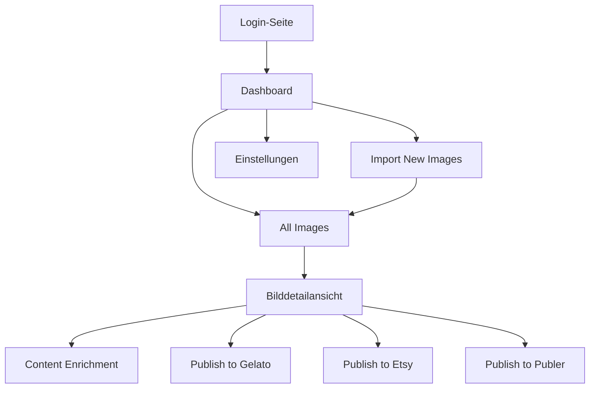
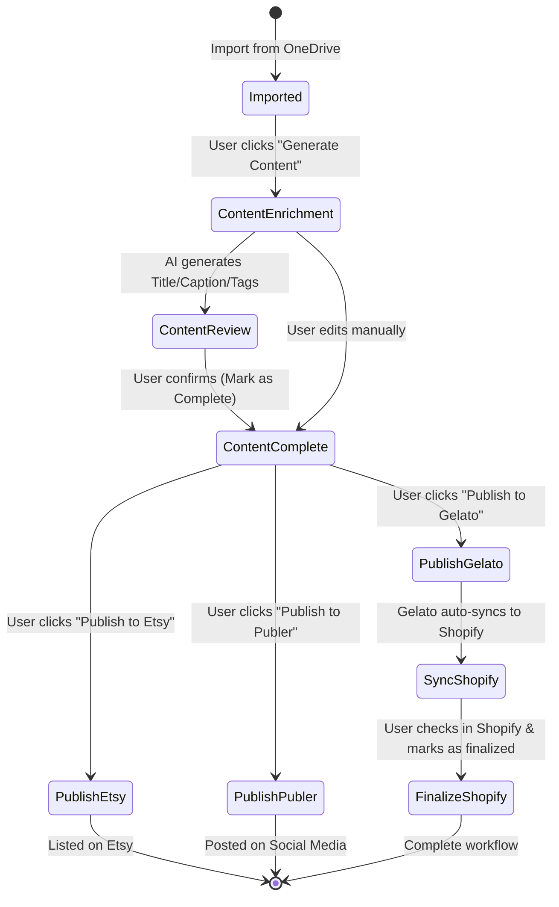

# Luxarise Manager - Frontend Concept

## Übersicht

Der Luxarise Manager ist eine Admin-Anwendung zur Verwaltung und Publikation von Kunstbildern über mehrere Verkaufs- und Social-Media-Kanäle. Diese Spezifikation beschreibt alle Masken, UI-Komponenten, Workflows und technischen Details für das Frontend.

## Architektur und Technologie-Stack

### Frontend Framework
- **Framework**: React mit Next.js
- **Styling**: Tailwind CSS oder CSS Modules
- **State Management**: React Context API / Zustand / Redux (je nach Komplexität)
- **UI-Komponenten**: Headless UI / Radix UI / shadcn/ui
- **Forms**: React Hook Form
- **Validierung**: Zod

### Backend Integration
- **CMS**: Storyblock CMS
- **APIs**: REST/GraphQL für Storyblock, Gelato, Etsy, Publer, Shopify
- **Authentifizierung**: Microsoft 365 OAuth 2.0
- **File Storage**: OneDrive/SharePoint

### Design Prinzipien
- Modern, clean, minimal
- Responsive (Mobile-first)
- Klare Visualisierung von Status-Informationen
- Accessibility (WCAG AA)
- Dark Mode Support (optional)

## Informationsarchitektur



## Navigationsstruktur

### Hauptnavigation
1. **Dashboard** - Übersicht und Statistiken
2. **Import New Images** - Bilder aus OneDrive importieren
3. **All Images** - Verwaltung aller Bilder
4. **Settings** - Konfiguration und Einstellungen

### Benutzermenü (Rechts oben)
- Benutzerprofil (Avatar + Name)
- Logout

---

## Masken und UI-Komponenten

### 1. Login-Maske

#### Zweck
Authentifizierung über Microsoft 365 OAuth mit E-Mail-Whitelist-Prüfung.

#### Layout
Zentrierte Card auf Vollbild-Hintergrund mit Gradient oder dezentem Muster.

#### UI-Elemente

**Logo-Bereich** (oben):
- Luxarise Logo (200x200px)
- App-Name "Luxarise Manager"
- Tagline: "Manage Your Art, Amplify Your Reach"

**Login-Card** (zentriert):
- Überschrift "Welcome Back"
- Beschreibungstext: "Sign in with your Microsoft 365 account to manage your art catalog"
- **Button**: "Sign in with Microsoft 365" (primär, prominent, Microsoft-Farben)
  - Icon: Microsoft Logo
  - Hover-State: Leichter Schatten
  
**Footer** (unten):
- Versionsnummer (klein, grau): "v1.0.0"
- Copyright: "© 2024 Luxarise"

#### Funktionalität

**OAuth-Flow**:
1. Klick auf "Sign in" → Redirect zu Microsoft OAuth
2. Nach erfolgreicher Authentifizierung → Redirect zurück zur App mit Token
3. Backend prüft E-Mail gegen Whitelist
4. Bei Erfolg: Weiterleitung zum Dashboard
5. Bei Fehler: Fehlermeldung "Access Denied. Your email is not authorized."

**Error Handling**:
- Toast-Benachrichtigung bei OAuth-Fehler
- Inline-Fehler bei nicht autorisierter E-Mail
- Retry-Button bei Netzwerkfehlern

#### Wireframe-Beschreibung

```
+------------------------------------------+
|                                          |
|           [Luxarise Logo]                |
|         Luxarise Manager                 |
|   Manage Your Art, Amplify Your Reach   |
|                                          |
|    +----------------------------+        |
|    |     Welcome Back           |        |
|    |                            |        |
|    |  Sign in with your         |        |
|    |  Microsoft 365 account     |        |
|    |                            |        |
|    |  [Microsoft] Sign in with  |        |
|    |         Microsoft 365      |        |
|    |                            |        |
|    +----------------------------+        |
|                                          |
|         v1.0.0 | © 2024 Luxarise        |
+------------------------------------------+
```

---

### 2. Dashboard (Hauptübersicht)

#### Zweck
Zentrale Übersicht über alle Bilder, deren Status und schnelle Zugriffsmöglichkeiten.

#### Layout
Header + Statistik-Cards + Quick Actions + Recent Activity

#### UI-Elemente

#### Header/Navigation
**Links**:
- Logo (klickbar → Dashboard)
- App-Name "Luxarise Manager"

**Mitte** (Hauptnavigation):
- Link "Dashboard" (aktiv)
- Link "Import New Images"
- Link "All Images"
- Link "Settings"

**Rechts**:
- Suchfeld (global, mit Icon)
  - Placeholder: "Search images..."
  - Dropdown mit Suchergebnissen bei Eingabe
- User-Avatar (klickbar)
  - Dropdown:
    - Name + E-Mail
    - "Logout" Button

#### Statistik-Cards (4 Cards in einer Reihe)

**Card 1: Total Images**
- Icon: 🖼️
- Zahl: Gesamtanzahl Bilder
- Label: "Total Images"
- Hintergrund: Blau-Gradient

**Card 2: Content Complete**
- Icon: ✓
- Zahl: Bilder mit vollständigem Content (gelber Haken)
- Label: "Content Complete"
- Hintergrund: Gelb-Gradient

**Card 3: Published Products**
- Icon: 📦
- Zahl: Veröffentlichte Produkte (Gelato/Shopify)
- Label: "Published Products"
- Hintergrund: Grün-Gradient

**Card 4: Social Media Posts**
- Icon: 📱
- Zahl: Social Media Posts (Publer)
- Label: "Social Media Posts"
- Hintergrund: Lila-Gradient

Jede Card zeigt:
- Große Zahl (60px, fett)
- Label (16px, medium)
- Icon (32px, rechts oben)
- Hover: Leichter Lift-Effekt

#### Quick Actions (unter den Cards)
- **Button "Import New Images"** (primär, groß, prominent)
  - Icon: ⬆️
  - Text: "Import New Images"
- **Button "View All Images"** (sekundär)
  - Icon: 📂
  - Text: "View All Images"

#### Recent Activity (untere Hälfte)
**Überschrift**: "Recent Activity"

**Liste** (5-10 Items):
Jedes Item zeigt:
- Thumbnail (80x80px, rund oder abgerundet)
- Bildname (fett)
- Status-Change (z.B. "Content completed", "Published to Gelato")
- Timestamp (relativ, z.B. "2 hours ago")
- Status-Icon (grün ✓, gelb ●, etc.)

**Layout**: Tabellen-ähnlich oder Card-Liste

#### Wireframe-Beschreibung

```
+---------------------------------------------------------------+
| [Logo] Luxarise Manager   [Dashboard] [Import] [All] [Settings]   [Search] [Avatar] |
+---------------------------------------------------------------+
|                                                               |
| +-------------+  +-------------+  +-------------+  +-------------+ |
| | 🖼️  Total   |  | ✓  Content  |  | 📦 Published|  | 📱 Social   | |
| |    Images   |  |   Complete  |  |   Products  |  |    Posts    | |
| |             |  |             |  |             |  |             | |
| |    250      |  |     180     |  |     120     |  |     45      | |
| +-------------+  +-------------+  +-------------+  +-------------+ |
|                                                               |
| [⬆️ Import New Images]  [📂 View All Images]                 |
|                                                               |
| Recent Activity                                               |
| +-----------------------------------------------------------+ |
| | [img] Image_001.jpg          Content completed   2h ago   | |
| | [img] Image_002.jpg          Published to Gelato 5h ago   | |
| | [img] Image_003.jpg          Imported             1d ago  | |
| +-----------------------------------------------------------+ |
+---------------------------------------------------------------+
```

---

### 3. Import New Images Maske

#### Zweck
Import von Bildern aus OneDrive/SharePoint in den Luxarise Manager.

#### Layout
Zweispaltig: Links Bildvorschau-Liste, Rechts Aktions-Panel

#### UI-Elemente

#### Header
- **Zurück-Button**: "← Back to Dashboard"
- **Titel**: "Import New Images"
- **Button**: "Refresh from OneDrive" (sekundär)
  - Icon: 🔄

#### Linke Spalte: Bildvorschau-Bereich (60% Breite)

**Info-Text** (wenn keine neuen Bilder):
- "No new images found in OneDrive"
- Button "Refresh"

**Grid mit neuen Bildern** (wenn vorhanden):
- Grid mit 2-3 Spalten
- Jedes Bild zeigt:
  - **Thumbnail-Vorschau** (300x300px)
  - **Dateiname** (editierbar, Inline-Input)
  - **Dateigröße** (z.B. "12.5 MB")
  - **Checkbox** (oben links über Bild)
  - **Preview-Icon** (Lupe, öffnet Lightbox mit Full-Size-Preview)

**Lightbox** (Modal beim Klick auf Preview):
- Full-Size Bild
- Dateiname
- Dateigröße
- Close-Button

#### Rechte Spalte: Aktionsbereich (40% Breite)

**Card: Import Settings**

**Select All/Deselect All**:
- Toggle-Button oder Checkbox "Select All" (5 images selected)

**Namensprefix** (optional):
- Input-Feld: "Name Prefix (optional)"
- Placeholder: "e.g., Painting_"
- Info: "Will be prepended to all imported image names"

**Import Button**:
- Button "Import Selected Images" (primär, groß)
  - Disabled wenn keine Auswahl
  - Icon: ⬇️

**Fortschrittsanzeige** (während Import):
- Progress Bar (0-100%)
- Text: "Importing 3 of 5 images..."
- Spinner

**Erfolgsmeldung** (nach Import):
- Grünes Success-Banner
- Text: "Successfully imported 5 images!"
- Button "View Imported Images" (Link zu All Images)

#### Funktionalität

**OneDrive-Verbindung**:
- API-Call zu OneDrive/SharePoint
- Anzeige neuer, noch nicht importierter Bilder
- Filter: Nur Bildformate (JPEG, PNG, TIFF)

**Import-Prozess**:
1. Auswahl von Bildern (Checkboxen)
2. Optional: Namensprefix hinzufügen
3. Klick auf "Import Selected Images"
4. Für jedes Bild:
   - Upload von Original (6000x6000px) zu Storyblock
   - Generierung von Thumbnail (2000x2000px) mit Wasserzeichen
   - Upload von Thumbnail zu Storyblock
   - Erstellung von Datensatz in Storyblock
   - Status: "Image Imported" → grün
5. Fortschrittsanzeige während Batch-Import
6. Erfolgsmeldung mit Link zu "All Images"

**Error Handling**:
- Toast bei Netzwerkfehler
- Inline-Fehler bei fehlgeschlagenem Upload (pro Bild)
- Retry-Möglichkeit

#### Wireframe-Beschreibung

```
+---------------------------------------------------------------+
| ← Back to Dashboard        Import New Images    [🔄 Refresh]  |
+---------------------------------------------------------------+
| LEFT: Bildvorschau          | RIGHT: Aktionen                  |
|                             |                                  |
| +--------+ +--------+       | [ ] Select All (5 selected)     |
| |[✓][img]| |[✓][img]|       |                                  |
| | Name1  | | Name2  |       | Name Prefix:                     |
| | 12MB   | | 15MB   |       | [________________]               |
| +--------+ +--------+       |                                  |
|                             | [⬇️ Import Selected Images]      |
| +--------+ +--------+       |                                  |
| |[ ][img]| |[ ][img]|       | ████████░░ 80%                   |
| | Name3  | | Name4  |       | Importing 4 of 5...              |
| | 10MB   | | 8MB    |       |                                  |
| +--------+ +--------+       |                                  |
+---------------------------------------------------------------+
```

---

### 4. All Images Maske (Bildübersicht)

#### Zweck
Verwaltung und Übersicht aller importierten Bilder mit Filter- und Suchfunktionen.

#### Layout
Filter-Sidebar (links) + Hauptbereich mit Toolbar + Bild-Grid/Liste

#### UI-Elemente

#### Filter-Sidebar (links, 250px breit)

**Suchfeld**:
- Input: "Search by name, description..."
- Icon: 🔍
- Real-time Filtering

**Status-Filter** (Checkbox-Liste):
- Überschrift: "Status"
- Checkboxen:
  - [ ] Imported
  - [ ] Content Complete
  - [ ] Published to Gelato
  - [ ] Finalized in Shopify
  - [ ] Published to Publer

**Sortierung** (Dropdown):
- Label: "Sort by"
- Optionen:
  - Name (A-Z)
  - Name (Z-A)
  - Date (Newest first)
  - Date (Oldest first)
  - Status

**Reset-Button**:
- "Clear all filters"

#### Hauptbereich

#### Toolbar (oben)
- **Links**: 
  - Ansichtsumschalter: 
    - Grid-Icon (aktiv)
    - List-Icon
- **Mitte**: 
  - Anzahl Ergebnisse: "Showing 45 images"
- **Rechts**: 
  - Bulk-Aktionen (nur sichtbar wenn Auswahl):
    - Dropdown "Actions"
      - "Generate Content for Selected"
      - "Publish Selected to Gelato"
      - "Delete Selected"

#### Grid-Ansicht (Standard)

**Grid-Layout**:
- Responsive: 3-4 Spalten (Desktop), 2 (Tablet), 1 (Mobile)
- Gap: 24px

**Bild-Card** (jede Card):
- **Thumbnail** (Quadratisch, z.B. 300x300px)
  - Mit Wasserzeichen
  - Hover: Overlay mit Quick-Actions
- **Bildname** (unter Thumbnail)
  - Editierbar per Inline-Edit (Klick → Input)
  - Truncate bei zu langem Namen
- **5 Status-Icons** (in einer Reihe)
  - Icon 1: Image Imported (grün ✓)
  - Icon 2: Content Complete (gelb ●, grün ✓, oder rot ✗)
  - Icon 3: Published to Gelato (grün ✓ oder grau ○)
  - Icon 4: Finalized in Shopify (grün ✓ oder grau ○)
  - Icon 5: Published to Publer (grün ✓ oder grau ○)
- **Checkbox** (oben links über Bild, für Bulk-Aktionen)

**Hover-State**:
- Overlay mit Buttons:
  - "Edit" (öffnet Detailansicht)
  - "Publish"
  - "Delete"

#### Listen-Ansicht

**Tabelle** mit Spalten:
- Checkbox (Auswahl)
- Thumbnail (klein, 80x80px)
- Name (sortierbar)
- Status 1: Imported (Icon)
- Status 2: Content Complete (Icon)
- Status 3: Published to Gelato (Icon)
- Status 4: Finalized in Shopify (Icon)
- Status 5: Published to Publer (Icon)
- Aktionen (Edit, Delete)

**Sortierung**:
- Klick auf Spaltenüberschrift

#### Pagination (unten)

- **Links**: "Items per page: [Dropdown: 20/50/100]"
- **Mitte**: "Page 1 of 5"
- **Rechts**: "← Previous | Next →"

#### Funktionalität

**Suche**:
- Real-time Filtering
- Suche in Name, Beschreibung, Tags
- Debouncing (300ms)

**Filter**:
- Multiple Auswahl möglich
- Filter kombinierbar (AND-Logik)
- Dynamische Ergebnis-Anzahl

**Bulk-Aktionen**:
- Auswahl mehrerer Bilder via Checkboxen
- "Select All" auf aktueller Seite
- Aktionen: Generate Content, Publish, Delete
- Bestätigungsdialog bei destruktiven Aktionen

**Performance**:
- Lazy Loading / Virtualisierung bei >100 Bildern
- Skeleton Screens beim Laden

#### Wireframe-Beschreibung

```
+---------------------------------------------------------------+
| Sidebar      | Toolbar + Grid                                  |
|              |                                                 |
| [Search]     | [Grid][List]  Showing 45 images  [Actions▼]   |
|              |                                                 |
| Status:      | +--------+  +--------+  +--------+              |
| [ ] Imported | |[✓][img]|  |[ ][img]|  |[ ][img]|              |
| [x] Content  | | Name1  |  | Name2  |  | Name3  |              |
| [ ] Gelato   | | ✓●○○○  |  | ✓✓✓○○  |  | ✓●○○○  |              |
|              | +--------+  +--------+  +--------+              |
| Sort by:     |                                                 |
| [Newest ▼]   | +--------+  +--------+  +--------+              |
|              | |[ ][img]|  |[ ][img]|  |[ ][img]|              |
| [Clear]      | | Name4  |  | Name5  |  | Name6  |              |
|              | | ✓✓✓✓○  |  | ✓○○○○  |  | ✓✓○○○  |              |
|              | +--------+  +--------+  +--------+              |
|              |                                                 |
|              | ← Previous  Page 1 of 5  Next →                |
+---------------------------------------------------------------+
```

---

### 5. Bilddetailansicht

#### Zweck
Detaillierte Bearbeitung und Publishing eines einzelnen Bildes.

#### Layout
Dreispaltig:
- Links (30%): Bildbereich
- Mitte (40%): Content Enrichment
- Rechts (30%): Status & Publishing

(Responsive: Tabs auf Mobile)

#### UI-Elemente

#### Header (über alle Spalten)
- **Links**: "← Back to All Images"
- **Mitte**: 
  - **Bildname** (großer Input, editierbar)
  - **Status-Badge**: "Complete" (grün) oder "In Progress" (gelb) oder "New" (grau)
    - Summary aller 5 Status
- **Rechts**: 
  - Button "Delete Image" (destruktiv, klein)

#### Linke Spalte: Bildbereich

**Bild-Container**:
- **Großes Thumbnail** (mit Wasserzeichen, max. Höhe: 600px)
- **Button "View Full Resolution"** (unter Bild)
  - Öffnet Modal oder neuen Tab mit Original (6000x6000)
- **Button "Replace Image"** (sekundär)
  - Öffnet Upload-Dialog

**Metadaten-Card** (unter Bild):
- Label "Metadata"
- **Original File Size**: "45.2 MB"
- **Thumbnail Size**: "8.3 MB"
- **Upload Date**: "Jan 15, 2024"
- **Last Modified**: "Jan 18, 2024, 3:45 PM"

#### Mittlere Spalte: Content Enrichment

**Überschrift**: "Content Enrichment"

**Titel-Sektion**:
- Label "Title"
- Textarea (1-2 Zeilen, auto-expand)
- Button "✨ Generate with AI" (rechts neben Label)
- Character Counter: "45/100"

**Caption-Sektion**:
- Label "Caption"
- Info-Text: "A lyrical, evocative description"
- Textarea (5-6 Zeilen)
- Button "✨ Generate with AI"
- Character Counter: "180/500"

**Tags-Sektion**:
- Label "Tags"
- Tag-Input mit Auto-Suggest
  - Input: "Add tag..."
  - Dropdown mit Vorschlägen (basierend auf vorhandenen Tags)
- Liste der aktuellen Tags (Pills, removable)
  - "abstract" [x]
  - "colorful" [x]
  - "modern art" [x]
- Button "✨ Generate with AI"

**Bulk-Action**:
- Button "Generate All Content" (primär, groß)
  - Generiert Titel, Caption, Tags in einem Schritt
- Info-Text: "Uses OpenAI API with configured prompts"

**Save-Button** (unten):
- Button "Save Changes" (primär)
- Auto-Save-Indicator: "Last saved 2 minutes ago"

#### Rechte Spalte: Status & Publishing

**Überschrift**: "Publishing Status"

**Status-Cards** (5 Cards vertikal):

**Status 1: Image Imported**
- Icon: ✓ (grün)
- Label: "Image Imported"
- Timestamp: "Jan 15, 2024, 10:30 AM"
- Keine Aktion (automatisch)

**Status 2: Content Complete**
- Icon: ● (gelb) oder ✓ (grün) oder ✗ (rot)
- Label: "Content Complete"
- Timestamp: "Jan 18, 2024, 3:45 PM" (wenn komplett)
- **Button "Mark as Complete"** (togglebar)
  - Grün wenn komplett, grau wenn nicht
  - Tooltip: "Mark content as reviewed and complete"

**Status 3: Published to Gelato**
- Icon: ✓ (grün) oder ○ (grau)
- Label: "Published to Gelato"
- Timestamp: "Jan 19, 2024, 11:20 AM" (wenn published)
- **Button "Publish to Gelato"** (primär)
  - Öffnet Publish-Dialog
- **Link** (wenn published): "View on Gelato →"

**Status 4: Finalized in Shopify**
- Icon: ✓ (grün) oder ○ (grau)
- Label: "Finalized in Shopify"
- Timestamp: "Jan 20, 2024, 2:15 PM" (wenn finalized)
- **Button "Open in Shopify"** (externer Link)
- **Checkbox "Mark as Finalized"** (manuell)

**Status 5: Published to Publer**
- Icon: ✓ (grün) oder ○ (grau)
- Label: "Published to Publer"
- Timestamp: "Jan 21, 2024, 9:00 AM" (wenn published)
- **Button "Publish to Publer"** (primär)
  - Öffnet Publish-Dialog
- **Link** (wenn published): "View on Publer →"

**Zusätzliche Aktionen** (unten):
- Button "Duplicate" (sekundär)
  - Erstellt Kopie des Bildes (für Varianten)

#### Funktionalität

**Content Enrichment**:
- **AI-Generierung**: 
  - Klick auf "Generate with AI" → API-Call zu OpenAI
  - Loading-State im Button (Spinner)
  - Automatisches Füllen des Felds
  - Toast: "Content generated successfully"
- **Manuelles Bearbeiten**: Jederzeit editierbar
- **Auto-Save**: Speichert automatisch nach 2 Sekunden Inaktivität
- **Validation**: Mindestlängen für Titel/Caption

**Publishing-Aktionen**:
- Jeder Publish-Button öffnet spezifischen Dialog (siehe Abschnitt 8)
- Status-Updates in Real-time
- Timestamps werden automatisch gesetzt

**Replace Image**:
- Upload-Dialog
- Validierung (Format, Größe)
- Automatische Re-Generierung von Thumbnail
- Warnung: "Replacing will affect published products"

#### Wireframe-Beschreibung

```
+---------------------------------------------------------------+
| ← Back            [=== Image_Name_001.jpg ===]        [Delete]|
+---------------------------------------------------------------+
| LEFT: Bild          | MIDDLE: Content      | RIGHT: Status   |
|                     |                      |                 |
| +---------------+   | Title:               | ✓ Imported      |
| |               |   | [_______________]    | Jan 15, 10:30   |
| |               |   | [✨ Generate AI]     |                 |
| |     IMAGE     |   |                      | ● Content       |
| |               |   | Caption:             | [Mark Complete] |
| |               |   | [_______________]    |                 |
| |               |   | [_______________]    | ○ Gelato        |
| +---------------+   | [_______________]    | [Publish]       |
|                     | [✨ Generate AI]     |                 |
| [View Full Res]     |                      | ○ Shopify       |
| [Replace Image]     | Tags:                | [Open] [ ] Done |
|                     | [abstract] [x]       |                 |
| Metadata:           | [colorful] [x]       | ○ Publer        |
| Size: 45.2 MB       | [Add tag...]         | [Publish]       |
| Upload: Jan 15      | [✨ Generate AI]     |                 |
|                     |                      |                 |
|                     | [Generate All]       | [Duplicate]     |
|                     | [Save Changes]       |                 |
+---------------------------------------------------------------+
```

---

### 6. Content Enrichment Modal/Panel

#### Zweck
Fokussierte Bearbeitung von KI-generiertem Content mit Regenerierungs-Möglichkeiten.

(Optional, wenn Content-Bearbeitung aus Bilddetailansicht ausgelagert werden soll)

#### Layout
Modal (zentriert) oder Slide-in-Panel (rechts)

#### UI-Elemente

**Header**:
- Titel: "Content Enrichment"
- Close-Button (X)

**Bildvorschau** (klein, oben):
- Thumbnail (150x150px)
- Bildname

**Tabs**:
- Tab "Title"
- Tab "Caption"
- Tab "Tags"

**Content-Bereich** (pro Tab):

**Title-Tab**:
- Aktueller Titel (Textarea)
- Button "Regenerate" (sekundär)
- Button "Save" (primär)
- Button "Cancel"

**Caption-Tab**:
- Aktuelle Caption (Textarea)
- Button "Regenerate"
- Button "Save"
- Button "Cancel"

**Tags-Tab**:
- Tag-Liste (Pills)
- Input für neue Tags
- Button "Regenerate All Tags"
- Button "Save"
- Button "Cancel"

**AI-Konfiguration** (expandierbar, unten):
- Toggle "Show AI Settings"
- Content (wenn expanded):
  - "Prompt Template" (read-only)
  - Link zu Settings: "Edit in Settings →"
  - "Model Version": "GPT-4"

#### Funktionalität

- Öffnet sich aus Bilddetailansicht oder Grid-Hover-Action
- Regenerierung einzelner Content-Felder
- Real-time Preview
- Save/Cancel Actions

---

### 7. Einstellungen (Settings)

#### Zweck
Globale Konfiguration der App, API-Keys, Prompts, Publishing-Templates.

#### Layout
Sidebar mit Kategorien (links) + Hauptbereich (rechts)

#### Kategorien-Sidebar (links, 250px)

- **AI Prompts**
- **API Configuration**
- **Publishing Settings**
- **Watermark Configuration**
- **User Management** (optional, zukünftig)

#### 7.1 AI Prompts

**Überschrift**: "AI Prompt Configuration"

**Title Generation Prompt**:
- Label: "Title Generation Prompt"
- Textarea (5-6 Zeilen, monospace)
- Info: "Template for generating image titles"
- Button "Reset to Default"
- Button "Save"

**Caption Generation Prompt**:
- Label: "Caption Generation Prompt"
- Textarea (8-10 Zeilen, monospace)
- Info: "Template for generating lyrical descriptions"
- Button "Test Prompt" (öffnet Test-Dialog)
- Button "Reset to Default"
- Button "Save"

**Tags Generation Prompt**:
- Label: "Tags Generation Prompt"
- Textarea (5-6 Zeilen, monospace)
- Info: "Template for generating relevant tags"
- Button "Reset to Default"
- Button "Save"

**Test-Dialog** (für Caption Prompt):
- Bildauswahl: Dropdown mit Beispielbildern
- Button "Run Test"
- Output: Generierte Caption
- Close

#### 7.2 API Configuration

**Überschrift**: "API Configuration"

**OpenAI API**:
- Label: "OpenAI API Key"
- Input (type="password", value="sk-...●●●●●●●●")
- Button "Update Key"
- Status: "✓ Connected" (grün) oder "✗ Not configured" (rot)

**OneDrive/SharePoint**:
- Label: "OneDrive Connection"
- Status: "✓ Connected" (grün) oder "✗ Not connected" (rot)
- Button "Reconnect"
- Info: "Connected as: user@example.com"

**Gelato API** (optional):
- Label: "Gelato API Key"
- Input (type="password")
- Button "Update Key"
- Status

**Etsy API**:
- Label: "Etsy API Key"
- Input (type="password")
- Button "Update Key"
- Status

**Publer API**:
- Label: "Publer API Key"
- Input (type="password")
- Button "Update Key"
- Status

**Shopify API**:
- Label: "Shopify API Token"
- Input (type="password")
- Button "Update Key"
- Label: "Shopify Shop URL"
- Input: "myshop.myshopify.com"
- Status

#### 7.3 Publishing Settings

**Überschrift**: "Publishing Settings"

**Gelato Product Templates**:
- Label: "Product Sizes & Prices"
- Table:
  - Column: Size | Price | Material | Active
  - Row 1: 30x30 cm | €49.00 | Canvas | [✓]
  - Row 2: 40x40 cm | €69.00 | Canvas | [✓]
  - Row 3: 50x50 cm | €89.00 | Canvas | [✓]
- Button "Add Size"
- Button "Save Changes"

**Shopify Settings**:
- Label: "Shopify Shop URL"
- Input: "myshop.myshopify.com"
- Label: "Default Collection"
- Input: "Art Prints"

**Publer Settings**:
- Label: "Active Channels"
- Checkboxes:
  - [✓] Facebook
  - [✓] Instagram
  - [✓] Pinterest
  - [✓] X (Twitter)
  - [✓] Threads
- Label: "Post Template"
- Textarea (5-6 Zeilen):
  ```
  {title}
  
  {caption}
  
  Shop now: {shopUrl}
  
  {tags}
  ```
- Info: "Available variables: {title}, {caption}, {tags}, {shopUrl}"
- Button "Save"

#### 7.4 Watermark Configuration

**Überschrift**: "Watermark Settings"

**Text**:
- Label: "Watermark Text"
- Input: "Luxurize"

**Opacity**:
- Label: "Opacity"
- Slider: 0-100% (default: 30%)
- Value: "30%"

**Position**:
- Label: "Position"
- Dropdown:
  - Center (default)
  - Bottom-Right
  - Bottom-Left
  - Top-Right
  - Top-Left

**Font Size**:
- Label: "Font Size"
- Slider: 50-200px (default: 100px)
- Value: "100px"

**Preview**:
- Label: "Preview"
- Card mit Beispielbild mit Wasserzeichen
- Button "Regenerate Thumbnails" (wendet neue Einstellungen auf alle Thumbnails an)
  - Warnung: "This will regenerate all thumbnails. This may take some time."

**Save-Button**:
- Button "Save Watermark Settings" (primär)

#### 7.5 User Management (zukünftig)

**Überschrift**: "User Management"

**Whitelist**:
- Label: "Authorized Email Addresses"
- List:
  - user1@example.com [Delete]
  - user2@example.com [Delete]
- Input: "Add email address"
- Button "Add"

**Roles** (zukünftig):
- Admin, Editor, Viewer

---

### 8. Publishing Modals/Dialogs

#### 8.1 Publish to Gelato Dialog

**Zweck**: Konfiguration und Publikation von Produkten zu Gelato.

**Modal-Layout**: Zentriert, 600px breit

**Header**:
- Titel: "Publish to Gelato"
- Close-Button (X)

**Content**:

**Bildvorschau**:
- Thumbnail (300x300px)
- Bildname

**Produktauswahl**:
- Label: "Select Product Sizes"
- Checkboxen:
  - [✓] 30x30 cm - €49.00
  - [✓] 40x40 cm - €69.00
  - [✓] 50x50 cm - €89.00

**Material-Auswahl**:
- Label: "Material"
- Radio Buttons:
  - (•) Canvas
  - ( ) Paper Print
  - ( ) Framed Canvas

**Preis-Preview**:
- Card: "Total: 3 products will be created"
- Info: "Products will be automatically synced to Shopify"

**Actions**:
- Button "Cancel" (sekundär)
- Button "Confirm & Publish" (primär)

**Während Publish**:
- Progress: "Publishing to Gelato..."
- Spinner

**Nach Erfolg**:
- Success-Banner: "Successfully published to Gelato!"
- Link: "View on Gelato →"
- Button "Close"

#### 8.2 Publish to Etsy Dialog

**Zweck**: Publikation als Digital Download auf Etsy.

**Modal-Layout**: Zentriert, 600px breit

**Header**:
- Titel: "Publish to Etsy"
- Close-Button (X)

**Content**:

**Bildvorschau**:
- Thumbnail (200x200px)

**Titel**:
- Label: "Listing Title"
- Input (vorausgefüllt aus Image Title)
- Max. 140 Zeichen

**Beschreibung**:
- Label: "Description"
- Textarea (vorausgefüllt aus Caption)

**Tags**:
- Label: "Tags"
- Tag-Input (vorausgefüllt)
- Max. 13 Tags

**Preis**:
- Label: "Price"
- Input: "€15.00"

**Digital Download Settings**:
- Checkbox: [✓] Digital Download
- Info: "High-resolution file (6000x6000px) will be provided"

**Actions**:
- Button "Cancel"
- Button "Publish to Etsy" (primär)

#### 8.3 Publish to Publer Dialog

**Zweck**: Erstellung von Social Media Posts über Publer.

**Modal-Layout**: Zentriert, 700px breit

**Header**:
- Titel: "Publish to Publer"
- Close-Button (X)

**Content**:

**Bildvorschau**:
- Thumbnail (300x300px)

**Channel-Auswahl**:
- Label: "Select Channels"
- Checkboxen:
  - [✓] Facebook
  - [✓] Instagram
  - [✓] Pinterest
  - [ ] X (Twitter)
  - [✓] Threads

**Post-Text-Preview**:
- Label: "Post Text"
- Tabs (pro ausgewähltem Kanal):
  - Tab "Facebook"
  - Tab "Instagram"
  - Tab "Pinterest"
  - Tab "Threads"
- Textarea pro Tab (editierbar)
  - Vorausgefüllt mit Template:
  ```
  {Title}
  
  {Caption}
  
  Shop now: {shopUrl}
  
  #abstract #art #colorful
  ```
- Character Counter pro Kanal

**Scheduling**:
- Label: "Scheduling"
- Radio Buttons:
  - (•) Post immediately
  - ( ) Schedule for later (Date/Time Picker)
  - ( ) Add to Publer Queue

**Actions**:
- Button "Cancel"
- Button "Send to Publer" (primär)

**Nach Erfolg**:
- Success-Banner: "Successfully sent to Publer!"
- Links: 
  - "View on Publer →"
  - "View scheduled posts →"
- Button "Close"

---

## Status-System (5 Checks)

### Farbcodierung

- **Grün ✓**: Abgeschlossen, erfolgreich
- **Gelb ●**: In Bearbeitung / Teilweise komplett / Warnung
- **Rot ✗**: Fehler / Nicht erfüllt
- **Grau ○**: Noch nicht gestartet / Inaktiv

### Die 5 Status-Checks

#### 1. Image Imported
- **Trigger**: Automatisch nach erfolgreichem Import
- **Icon**: Grün ✓ (immer)
- **Timestamp**: Upload-Datum
- **Aktion**: Keine (automatisch)

#### 2. Content Complete
- **Zustände**:
  - **Rot ✗**: Keine Content-Daten (Titel, Caption, Tags leer)
  - **Gelb ●**: Content automatisch generiert, aber nicht manuell bestätigt
  - **Grün ✓**: Manuell bestätigt oder manuell bearbeitet
- **Timestamp**: Zeitpunkt der Bestätigung/Bearbeitung
- **Aktion**: Button "Mark as Complete" (togglebar)
- **Logik**: Wird gelb sobald AI-Content generiert wurde, grün wenn Nutzer bestätigt

#### 3. Published to Gelato
- **Zustände**:
  - **Grau ○**: Noch nicht published
  - **Grün ✓**: Erfolgreich published
- **Timestamp**: Zeitpunkt der Publikation
- **Aktion**: Button "Publish to Gelato"
- **Extra**: Link zu Gelato-Produktseite (wenn published)

#### 4. Finalized in Shopify
- **Zustände**:
  - **Grau ○**: Noch nicht finalized
  - **Grün ✓**: Manuell als finalized markiert
- **Timestamp**: Zeitpunkt der Finalisierung
- **Aktion**: 
  - Button "Open in Shopify" (externer Link)
  - Checkbox "Mark as Finalized"
- **Info**: Manueller Check nach Shopify-Sync

#### 5. Published to Publer
- **Zustände**:
  - **Grau ○**: Noch nicht published
  - **Grün ✓**: Erfolgreich published
- **Timestamp**: Zeitpunkt der Publikation
- **Aktion**: Button "Publish to Publer"
- **Extra**: Links zu Publer-Posts (wenn published)

### Anzeige in verschiedenen Views

#### Grid-Ansicht (All Images)
- Icons in einer horizontalen Reihe unter Thumbnail
- Kleine Icons (16x16px)
- Tooltip bei Hover (Status-Name + Timestamp)

```
+------------------+
|   [Thumbnail]    |
|                  |
+------------------+
| Image_Name_001   |
| ✓ ● ○ ○ ○        |
+------------------+
```

#### Listen-Ansicht (All Images)
- Icons in separaten Spalten
- Sortierbar nach jedem Status

```
| [img] | Name        | 1 | 2 | 3 | 4 | 5 |
|-------|-------------|---|---|---|---|---|
| [img] | Image_001   | ✓ | ● | ○ | ○ | ○ |
| [img] | Image_002   | ✓ | ✓ | ✓ | ○ | ○ |
```

#### Detailansicht
- Vollständige Status-Cards mit:
  - Icon (groß, 32x32px)
  - Status-Name
  - Timestamp (formatiert)
  - Aktions-Buttons
  - Zusätzliche Infos/Links

---

## Datenstrukturen

### TypeScript Interfaces

```typescript
// Hauptdatenmodell für ein Bild
interface Image {
  id: string; // Unique ID (UUID)
  name: string; // Bildname (editierbar)
  
  // Datei-URLs
  originalUrl: string; // 6000x6000px Original
  thumbnailUrl: string; // 2000x2000px mit Wasserzeichen
  
  // Metadaten
  fileSize: number; // in Bytes
  thumbnailSize: number; // in Bytes
  uploadDate: string; // ISO 8601
  lastModified: string; // ISO 8601
  
  // Content Enrichment
  title: string; // AI-generiert oder manuell
  caption: string; // Lyrische Beschreibung
  tags: string[]; // Array von Tags
  
  // Status (5 Checks)
  status: {
    imported: StatusCheck;
    contentComplete: StatusCheck;
    publishedGelato: StatusCheck;
    finalizedShopify: StatusCheck;
    publishedPubler: StatusCheck;
  };
  
  // Publishing-Daten
  gelatoProductId?: string; // Gelato Product ID
  gelatoProductUrl?: string; // Link zu Gelato-Produkt
  shopifyProductId?: string; // Shopify Product ID
  shopifyProductUrl?: string; // Link zu Shopify-Produkt
  etsyListingId?: string; // Etsy Listing ID
  etsyListingUrl?: string; // Link zu Etsy-Listing
  publerPostIds?: string[]; // Array von Publer Post IDs
  publerPostUrls?: string[]; // Links zu Publer-Posts
}

// Status-Check-Objekt
interface StatusCheck {
  completed: boolean; // true wenn komplett
  timestamp?: string; // ISO 8601, wann Status erreicht wurde
  color: 'green' | 'yellow' | 'red' | 'gray'; // UI-Farbe
  manuallyConfirmed?: boolean; // für Content Complete
  errorMessage?: string; // Bei Fehlern
}

// User-Objekt (nach OAuth)
interface User {
  id: string;
  email: string;
  name: string;
  avatar?: string;
  role: 'admin' | 'editor' | 'viewer'; // Zukünftig
}

// Settings-Objekt
interface Settings {
  aiPrompts: {
    titlePrompt: string;
    captionPrompt: string;
    tagsPrompt: string;
  };
  
  apiKeys: {
    openai: string;
    gelato?: string;
    etsy: string;
    publer: string;
    shopify: string;
  };
  
  publishing: {
    gelatoProducts: GelatoProduct[];
    shopifyShopUrl: string;
    shopifyDefaultCollection: string;
    publerChannels: string[]; // ['facebook', 'instagram', ...]
    publerPostTemplate: string;
  };
  
  watermark: {
    text: string;
    opacity: number; // 0-100
    position: 'center' | 'bottom-right' | 'bottom-left' | 'top-right' | 'top-left';
    fontSize: number; // px
  };
  
  userManagement: {
    whitelist: string[]; // Array von E-Mail-Adressen
  };
}

// Gelato-Produkt-Template
interface GelatoProduct {
  id: string;
  size: string; // z.B. "30x30 cm"
  price: number; // in Euro
  material: string; // z.B. "Canvas"
  active: boolean;
}

// Filter-State für All Images
interface ImageFilters {
  searchQuery: string;
  statusFilters: {
    imported: boolean;
    contentComplete: boolean;
    publishedGelato: boolean;
    finalizedShopify: boolean;
    publishedPubler: boolean;
  };
  sortBy: 'name-asc' | 'name-desc' | 'date-newest' | 'date-oldest' | 'status';
  viewMode: 'grid' | 'list';
  itemsPerPage: 20 | 50 | 100;
  currentPage: number;
}

// API-Response für Bildliste
interface ImagesResponse {
  images: Image[];
  total: number;
  page: number;
  perPage: number;
  hasMore: boolean;
}

// Import-Request
interface ImportRequest {
  fileIds: string[]; // OneDrive File IDs
  namePrefix?: string;
}

// AI-Generation-Request
interface AIGenerationRequest {
  imageId: string;
  type: 'title' | 'caption' | 'tags' | 'all';
  prompt?: string; // Optional, falls custom Prompt
}

// Publish-Request (Gelato)
interface PublishGelatoRequest {
  imageId: string;
  productSizes: string[]; // z.B. ["30x30 cm", "40x40 cm"]
  material: string;
}

// Publish-Request (Publer)
interface PublishPublerRequest {
  imageId: string;
  channels: string[]; // z.B. ["facebook", "instagram"]
  postTexts: Record<string, string>; // Channel → Post-Text
  scheduling: {
    type: 'immediate' | 'scheduled' | 'queue';
    scheduledTime?: string; // ISO 8601
  };
}
```

---

## Workflow-Diagramm



### Workflow-Beschreibung

1. **Import**: Nutzer importiert Bilder aus OneDrive → Status 1 (Imported) wird grün
2. **Content Enrichment**: Nutzer generiert AI-Content (Titel/Caption/Tags) → Status 2 wird gelb
3. **Review**: Nutzer überprüft und bestätigt Content → Status 2 wird grün
4. **Publish to Gelato**: Nutzer publisht zu Gelato → Status 3 wird grün → Auto-Sync zu Shopify
5. **Finalize Shopify**: Nutzer prüft Shopify-Produkt und bestätigt → Status 4 wird grün
6. **Publish to Publer**: Nutzer postet auf Social Media → Status 5 wird grün
7. **(Optional) Publish to Etsy**: Parallel zu Gelato/Publer möglich

**Alternative Workflows**:
- User kann direkt zu Etsy publishen (ohne Gelato)
- User kann Content manuell eingeben (ohne AI)
- User kann mehrere Publish-Aktionen parallel durchführen

---

## Responsive Design

### Breakpoints

```css
/* Mobile */
@media (max-width: 767px) { }

/* Tablet */
@media (min-width: 768px) and (max-width: 1199px) { }

/* Desktop */
@media (min-width: 1200px) { }
```

### Layout-Anpassungen

#### Dashboard (Mobile <768px)
- **Statistik-Cards**: Vertikal gestapelt (1 Spalte)
- **Quick Actions**: Vertikal gestapelt
- **Recent Activity**: Scrollbare Liste

#### All Images (Mobile)
- **Filter-Sidebar**: Collapsible (Button "Filters" öffnet Overlay)
- **Grid**: 1-2 Spalten
- **Liste**: Nur essentielle Spalten (Thumbnail, Name, Hauptstatus)
- **Pagination**: Simplified (nur Prev/Next)

#### Bilddetailansicht (Mobile)
- **Layout**: Von 3 Spalten zu Tabs
  - Tab "Image"
  - Tab "Content"
  - Tab "Status"
- **Header**: Vereinfacht (nur Zurück-Button + Name)

#### Navigation (Mobile)
- **Hauptnavigation**: Bottom Tab Bar
  - Icons: Home, Import, Images, Settings
- **User-Menu**: In Settings-Tab integriert

#### Modals (Mobile)
- **Full-Screen**: Dialogs werden zu Full-Screen-Views
- **Buttons**: Sticky Footer

### Touch-Optimierungen
- Mindestgröße für Touch-Targets: 44x44px
- Swipe-Gesten:
  - Swipe links/rechts in Bilddetailansicht: Nächstes/Vorheriges Bild
  - Pull-to-refresh in Listen
- Tap-Highlights

---

## Komponenten-Bibliothek

### UI-Komponenten (zu implementieren oder aus Library)

#### Basis-Komponenten
- **Button**: primary, secondary, destructive, ghost, icon
- **Input**: text, password, search, number
- **Textarea**: auto-expand, character counter
- **Select**: native, custom dropdown
- **Checkbox**: standard, toggle-switch
- **Radio**: standard
- **Tag/Badge**: removable, colored
- **Avatar**: image, initials fallback
- **Icon**: SVG-based (z.B. Heroicons, Lucide)

#### Layout-Komponenten
- **Card**: container mit Shadow/Border
- **Modal/Dialog**: overlay, centered, full-screen (mobile)
- **Sidebar**: collapsible, fixed
- **Tabs**: horizontal, vertical
- **Accordion**: expandable sections

#### Feedback-Komponenten
- **Toast/Notification**: success, error, warning, info
  - Auto-dismiss nach 5 Sekunden
  - Stackable (max. 3 gleichzeitig)
- **Loader/Spinner**: inline, overlay, page-level
- **Progress Bar**: determinate, indeterminate
- **Skeleton Screen**: für Loading-States

#### Daten-Komponenten
- **Table**: sortierbar, selectable rows
- **Pagination**: standard, compact
- **ImageCard**: Custom-Komponente mit Status-Icons
- **StatusIcon**: Custom-Komponente (farbige Icons)
- **StatusCheckList**: Custom-Komponente (5 Status-Cards)

#### Custom-Komponenten (zu entwickeln)

**ImageCard**:
```typescript
interface ImageCardProps {
  image: Image;
  viewMode: 'grid' | 'list';
  onEdit: (id: string) => void;
  onDelete: (id: string) => void;
  onSelect: (id: string, selected: boolean) => void;
  isSelected: boolean;
}
```

**StatusIcon**:
```typescript
interface StatusIconProps {
  status: StatusCheck;
  size?: 'sm' | 'md' | 'lg';
  showTooltip?: boolean;
}
```

**StatusCheckCard**:
```typescript
interface StatusCheckCardProps {
  status: StatusCheck;
  label: string;
  timestamp?: string;
  actionButton?: ReactNode;
  externalLink?: string;
}
```

---

## Fehlerbehandlung & Feedback

### Toast-Benachrichtigungen

**Farben/Icons**:
- **Success** (grün): ✓ "Successfully imported 5 images!"
- **Error** (rot): ✗ "Failed to connect to OneDrive"
- **Warning** (gelb): ⚠ "Some images could not be imported"
- **Info** (blau): ℹ "Content generation in progress..."

**Positionen**:
- Top-Right (Desktop)
- Top-Center (Mobile)

**Timing**:
- Auto-dismiss nach 5 Sekunden (oder manuell schließbar)
- Errors bleiben bis manuell geschlossen

### Inline-Validierung

**Formularfelder**:
- Echtzeit-Validierung bei Input
- Error-Messages unter Feld
- Rote Border bei Fehler

**Beispiele**:
- "Title is required" (wenn leer)
- "Caption must be at least 50 characters" (wenn zu kurz)
- "Invalid email format" (bei E-Mail-Input)

### Error-States

**API-Fehler**:
- Retry-Button
- Error-Message
- Fallback-Content

**Netzwerkfehler**:
- Offline-Banner: "You are offline. Changes will be synced when you reconnect."
- Retry-Mechanismen

**Empty States**:
- "No images found" (mit Illustration)
- "No results match your filters" (mit "Clear filters" Button)

### Loading States

**Initial Load**:
- Skeleton Screens (z.B. für Image-Grid)
- Page-Level Spinner (bei Dashboard-Load)

**Button-Actions**:
- Spinner in Button
- Disabled-State
- Text: "Importing..." / "Publishing..." / "Generating..."

**Progress Indicators**:
- Progress Bar bei Batch-Operationen (Import, Bulk-Actions)
- Percentage: "Importing 3 of 5 images... 60%"

---

## Accessibility (A11y)

### Semantisches HTML
- `<header>`, `<nav>`, `<main>`, `<aside>`, `<footer>`
- `<button>` statt `<div onClick>`
- `<a>` für Links (mit `href`)

### ARIA-Labels
- Icons: `aria-label="Delete image"`
- Status-Icons: `aria-label="Status: Content complete"`
- Buttons ohne Text: `aria-label="Close dialog"`

### Keyboard-Navigation
- Tab-Order: Logisch von oben nach unten, links nach rechts
- Focus-States: Deutlich sichtbar (blaue Border, 2-3px)
- Modals:
  - Focus-Trap (Tab-Navigation innerhalb Modal)
  - ESC schließt Modal
- Shortcuts:
  - `/` fokussiert Suchfeld
  - `n` öffnet "Import New Images" (wenn auf Dashboard)
  - `←` / `→` navigiert durch Bilder (in Detailansicht)

### Screen-Reader Support
- Alt-Texte für alle Bilder
- `aria-live` für dynamische Inhalte (Toast-Messages)
- `role="status"` für Status-Updates

### Kontrastverhältnis
- WCAG AA Standard: mindestens 4.5:1 (Text zu Hintergrund)
- Große Texte (18pt+): mindestens 3:1
- Icons: deutlich erkennbar

### Focus-Indikatoren
- Sichtbare Focus-States für alle interaktiven Elemente
- Keine `outline: none` ohne Alternative

---

## Performance-Überlegungen

### Lazy Loading
- **Bilder**: Nur sichtbare Thumbnails laden
  - Intersection Observer API
  - Placeholder während Laden (Blur-Hash oder Skeleton)
- **Routes**: Code-Splitting mit Next.js dynamic imports

### Virtualisierung
- Bei langen Listen (>100 Bilder): React Virtual (z.B. `react-window`, `react-virtualized`)
- Nur sichtbare Items im DOM

### Thumbnail-Optimierung
- Responsive Images: `srcset` für verschiedene Auflösungen
- WebP-Format (mit JPEG-Fallback)
- CDN für schnelle Auslieferung

### Debouncing
- Suchfeld: 300ms Debounce
- Auto-Save: 2 Sekunden Debounce

### Caching
- API-Responses: In-Memory-Cache (z.B. React Query, SWR)
- Stale-While-Revalidate-Strategie
- Local Storage für Settings

### Optimistic UI Updates
- Sofortiges UI-Update bei User-Aktionen
- Rollback bei Fehler
- Beispiel: Checkbox "Mark as Complete" → sofort grün, bei API-Fehler → zurück zu gelb

### Code-Splitting
- Route-based Splitting (automatisch mit Next.js)
- Component-Level Splitting für große Komponenten (z.B. Modals)

### Bundle-Size-Optimierung
- Tree-Shaking
- Lazy-Loading von Icons
- Nur benötigte UI-Komponenten importieren

---

## Zusätzliche Features (Optional/Zukünftig)

### Dark Mode
- Toggle in User-Menu
- CSS Variables für Farben
- Speicherung in Local Storage

### Bulk-Operationen
- Auswahl mehrerer Bilder (Checkboxen)
- Aktionen:
  - Generate Content for Selected
  - Publish Selected to Gelato
  - Delete Selected
  - Export Selected (Download ZIP)

### Drag & Drop
- Drag & Drop für Image-Upload (in Import-Maske)
- Drag & Drop für Reordering (in Image-Grid)

### Notifications
- In-App-Notifications für asynchrone Prozesse
- "Image_001 has been published to Gelato"
- Notification-Center (Glocken-Icon im Header)

### History/Audit-Log
- Änderungshistorie pro Bild
- Wer hat wann was geändert
- Rollback-Funktion

### Multi-User-Collaboration
- Locking-Mechanismus (wenn anderer User Bild bearbeitet)
- Real-time Updates (WebSockets)

### Analytics
- Dashboard mit Publishing-Statistiken
- Charts: Veröffentlichungen pro Monat, beliebteste Tags, etc.

### Export/Import
- Export von Bildern + Metadaten (CSV, JSON)
- Import von Bildern mit Metadaten

---

## Technische Spezifikationen

### API-Endpunkte (Backend)

**Auth**:
- `POST /api/auth/login` - OAuth-Login
- `POST /api/auth/logout` - Logout
- `GET /api/auth/me` - Aktueller User

**Images**:
- `GET /api/images` - Liste aller Bilder (mit Pagination, Filter)
- `GET /api/images/:id` - Einzelnes Bild
- `POST /api/images/import` - Import aus OneDrive
- `PATCH /api/images/:id` - Update Bild (Name, Content)
- `DELETE /api/images/:id` - Löschen

**Content Generation**:
- `POST /api/images/:id/generate-title` - AI-Title generieren
- `POST /api/images/:id/generate-caption` - AI-Caption generieren
- `POST /api/images/:id/generate-tags` - AI-Tags generieren
- `POST /api/images/:id/generate-all` - Alle Content-Felder generieren

**Publishing**:
- `POST /api/images/:id/publish-gelato` - Publish zu Gelato
- `POST /api/images/:id/publish-etsy` - Publish zu Etsy
- `POST /api/images/:id/publish-publer` - Publish zu Publer
- `PATCH /api/images/:id/finalize-shopify` - Shopify finalisieren

**Settings**:
- `GET /api/settings` - Alle Settings
- `PATCH /api/settings` - Update Settings
- `POST /api/settings/test-prompt` - Prompt testen

**OneDrive**:
- `GET /api/onedrive/new-images` - Neue Bilder aus OneDrive

### State Management

**Global State** (Context/Zustand/Redux):
- User
- Settings
- Toast-Notifications

**Local State** (React State):
- Formular-Daten
- UI-States (Modals, Dropdowns)

**Server State** (React Query/SWR):
- Images (mit Cache)
- API-Responses

### Performance-Ziele

- **First Contentful Paint**: <1.5s
- **Time to Interactive**: <3s
- **Lighthouse Score**: >90
- **Bundle Size**: <500KB (gzipped)

---

## Zusammenfassung

Dieses Frontendkonzept beschreibt eine vollständige Admin-Anwendung für den Luxarise Manager mit folgenden Kernfunktionen:

1. **Bildverwaltung**: Import aus OneDrive, Verwaltung in übersichtlicher Grid/Listen-Ansicht
2. **Content Enrichment**: AI-gestützte Generierung von Titeln, Captions und Tags
3. **Multi-Channel-Publishing**: Gelato, Shopify, Etsy, Publer
4. **Status-Tracking**: 5 klar definierte Status-Checks mit visueller Darstellung
5. **Konfiguration**: Umfangreiche Settings für AI-Prompts, APIs, Publishing-Templates

**Design-Prinzipien**:
- Modern, clean, übersichtlich
- Responsive (Mobile-first)
- Accessibility (WCAG AA)
- Performance-optimiert
- Klare Status-Visualisierung

**Nächste Schritte**:
1. UI-Design (Mockups in Figma)
2. Frontend-Implementierung (React/Next.js)
3. Backend-Integration (Storyblock, APIs)
4. Testing (Unit, Integration, E2E)
5. Deployment

---

**Version**: 1.0  
**Datum**: Januar 2024  
**Autor**: Luxarise Team
